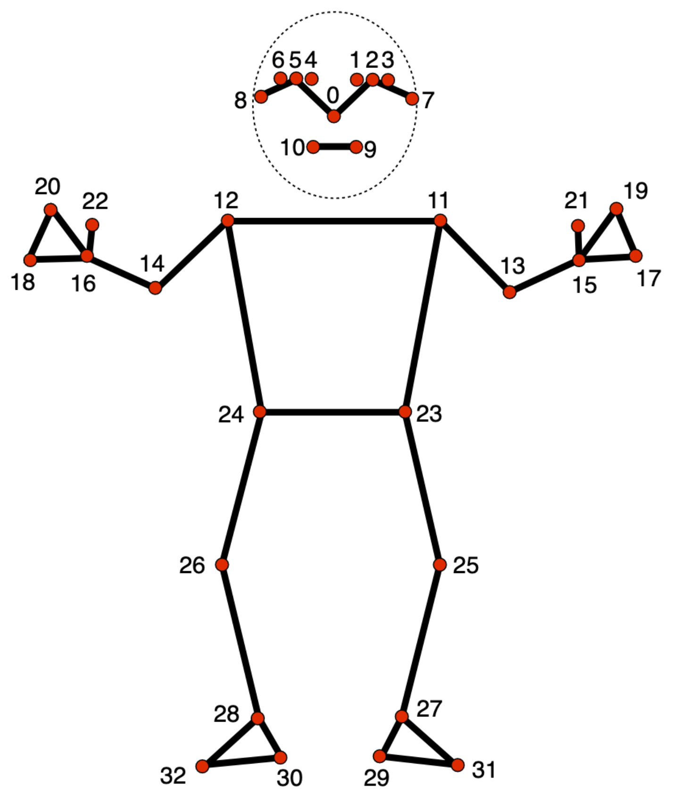

# demo.land

Perform a real-time comparison of multiple hand gestures using Web Socket.

## Links

- [Server Stats](https://hammerhead-app-3hrzw.ondigitalocean.app/)

- [Pose landmarks detection guide](https://developers.google.com/mediapipe/solutions/vision/pose_landmarker)

  

## Legal

- [images/no-signal.jpg](https://unsplash.com/photos/0W4XLGITrHg)
